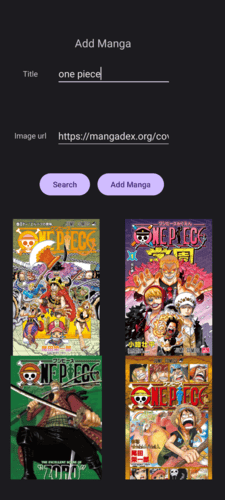

# Manga Manager

## Project Description

I created this app because, as someone who enjoys reading manga, I found it hard to keep track of the ones I'd read.
I used to save manga titles in a Google Keep note, but since many titles weren’t in English, I often forgot which title matched which manga.
To solve this, I developed an Android app that lets me search for manga by title and save the cover image. 
By tapping on the cover, the app copies the title to my clipboard, making it easy to search for and read the manga in the future.

## Screenshots

### Main Page

### Page to search for manga

### Main Page after adding manga

